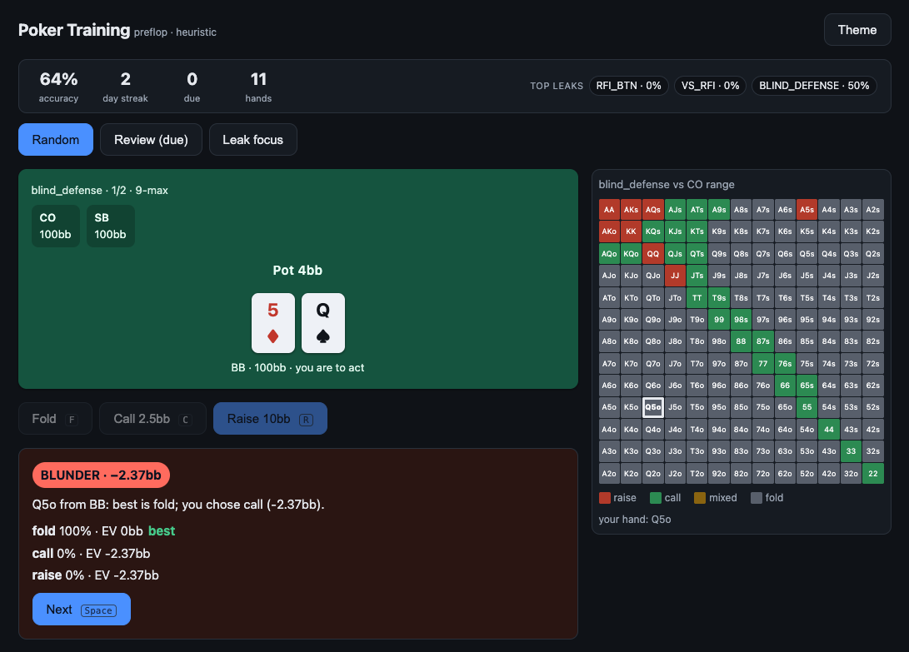
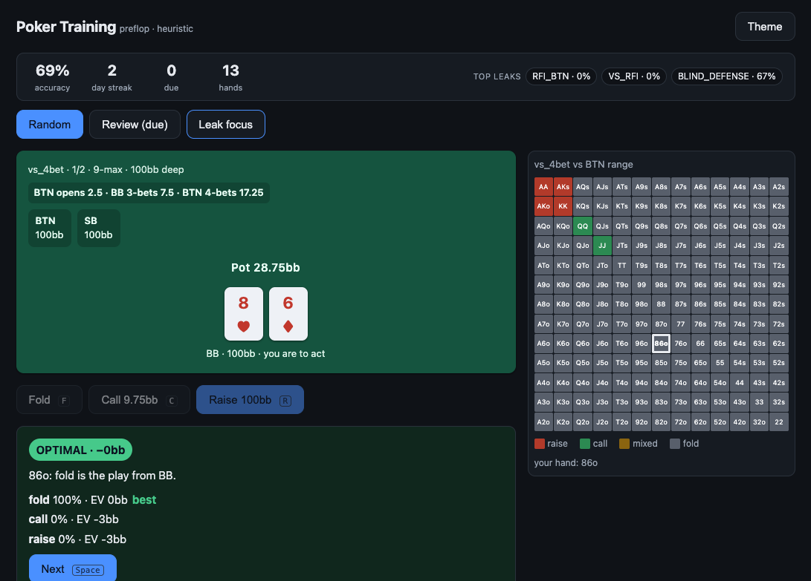
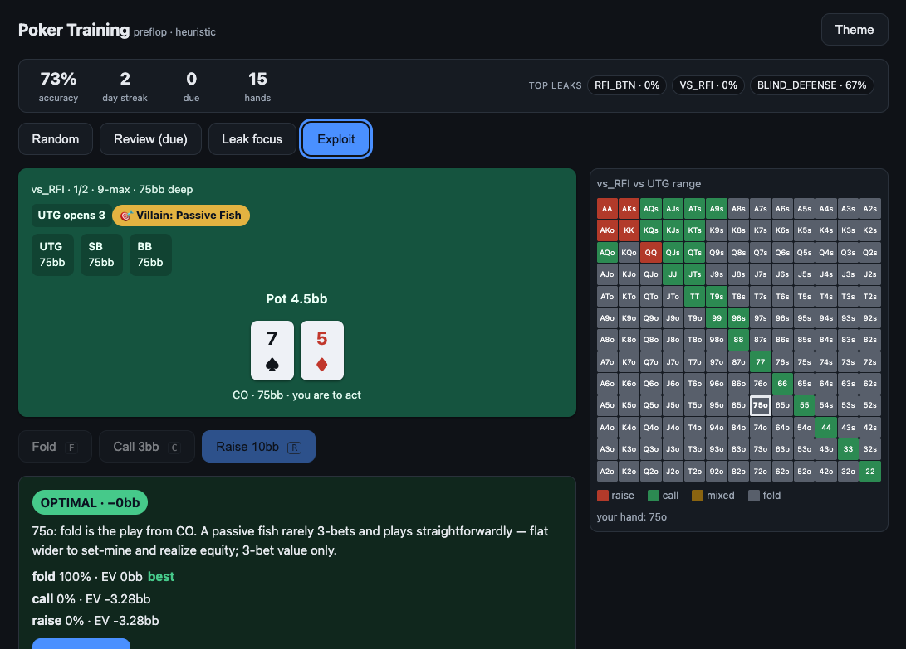
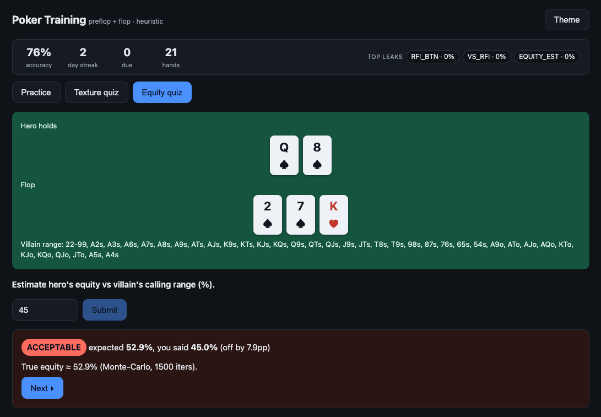

# Poker Training — local NLHE trainer

A local web app to drill and train live No-Limit Texas Hold'em strategy, tailored
for the $1/$2 → $2/$3 climb. Simplified-but-sound (not pure GTO), preflop first.

Plan: `docs/ai-dlc/roadmap.md` · Strategy research: `docs/research/` · Spec/tickets: `docs/ai-dlc/`.

## Layout
```
backend/   FastAPI API + pure domain core + SQLite/Alembic
frontend/  React + Vite
content/   strategy content packs + JSON schema
docs/      research, roadmap, specs, tickets
scripts/   verify.sh
```

## Architecture (why it scales)
- **Pure domain core** (`backend/app/domain/`) — Spot, Decision, EvaluationResult,
  content packs, SRS, leaks. No web/DB imports (enforced by a test).
- **Swappable `StrategyProvider`** — grading is one async interface. Today a
  heuristic provider; a solver-table provider drops in later with no rebuild.
- **Strategy as versioned data** — ranges live in content packs, not code.
- **Freq + EV results, never boolean** — feedback/SRS/leaks all consume the rich shape.

## Screenshots
| Preflop trainer | Facing aggression | Exploit archetypes | Postflop equity |
| --- | --- | --- | --- |
|  |  |  |  |

## Setup & run

**Backend** (Python ≥ 3.12):
```bash
cd backend
python -m venv .venv && source .venv/bin/activate
pip install -e ".[dev]"
```

**Frontend** (Node ≥ 20):
```bash
cd frontend
npm install
```

**Run** (two terminals):
```bash
# backend — API on :8000
cd backend && uvicorn app.main:app --reload
# frontend — UI on :5173
cd frontend && npm run dev
```
Open `http://localhost:5173`. API health: `http://localhost:8000/api/v1/health` · interactive docs at `/docs`.

**Checks:**
```bash
./scripts/verify.sh          # backend tests + boot probe
cd backend && ruff check .   # lint
cd frontend && npm run typecheck && npm run build
```

## Status
**Phase 0** (foundations) complete & verified. **Phase 1a** (real preflop trainer) built:
research-backed ranges for RFI / facing-an-open / blind defense / vs-limpers, frequency-tolerant
grading, SM-2 spaced repetition, auto leak tracking, drill modes (random / review / leak-focus),
and a lean React UI (multi-action bar, mode selector, colored 13×13 grid, stats strip).
**Phase 1b** adds facing-aggression (vs-3-bet 4bet/call/fold, vs-4-bet jam/call/fold) + a
betting-line display + light stack-depth variety. **Phase 1c** adds exploit / villain-archetype drills
(calling station / nit / LAG / fish) with a GTO-vs-exploit contrast on high-leverage nodes.

**Phase 2a — first postflop slice — built & verified (128 backend tests green):** a pure-Python
equity engine (7-card evaluator + Monte-Carlo `equity_vs_range` with dead-card filtering), a
rule-based board-texture classifier, a dedicated flop **c-bet grader** (texture + positional
range-advantage heuristic, *not* equity-backed — that's 2b), a `CompositeProvider` routing by street
(preflop → heuristic, flop → postflop), a flop-c-bet drill mode, and two foundational quizzes
(board-texture classification, equity estimation) with tolerance-band grading. Postflop spots get a
texture/SPR-bucketed signature; preflop hashes are byte-identical to before. No new DB migration.

Next: Phase 2b (turn / facing-a-c-bet / check-raise + equity-backed range advantage), then squeeze
(multiway) + mastery-gating.

## How this was built
Developed with an AI-assisted, spec-first workflow: each phase started from written research and a
delta spec (`docs/`), was broken into tickets, then implemented and verified against tests before the
next phase. The architecture (pure domain core, swappable strategy provider, content-as-data) was
chosen up front so later phases extend rather than rewrite.
